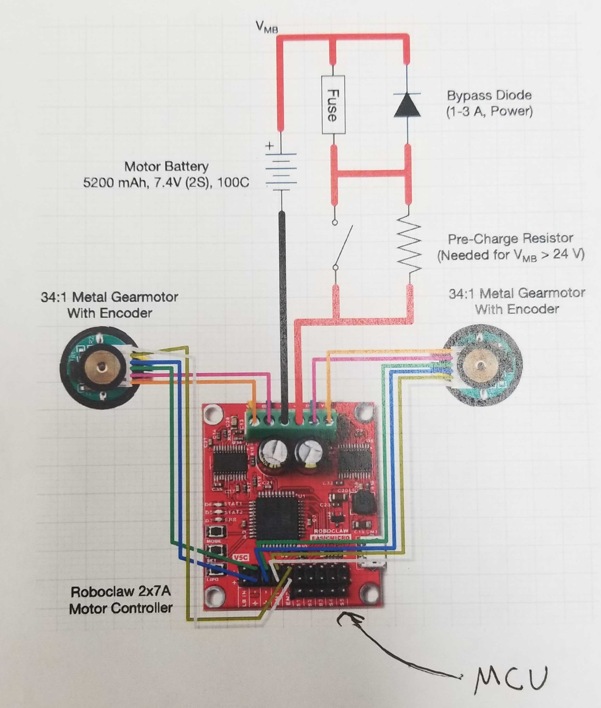

# Robot Instructions

## **Physical Features**

### **Robot Circuit**

### **Components**

- 1 x Roboclaw 2x7A Motor Controller
- 2 x Metal Gearmotors
- 2 x Rubber wheels
- 1 x Sliding wheel
- 1 x Switch
- 1 x Fuse
- 1 x Jetson nano
- 1 x Acrylic plate
- 2 x 5200mA 7.4 V Lithium Polymer Batteries
- 1 x DC-DC Buck Converter Step Down Module
- 1 x Bypass diode

### **Power**

Two batters: one for the jetson and one for the roboclaw. Battery for the jeston has a T-plug male connecter. This wire is connected to a step down module that drops the voltage to 5.0V. From the resistor is a red/black wire with a Barrel jack connector for the jetson. Note that the battery for the jetson is labeled with the name "jetson"

TODO: write about power to roboclaw

### **Checking the motors**

To check if the motors are working without the jetson, power up the roboclaw. With the lab's windows laptop, plug in a micro USB cable from the laptop to the roboclaw. Once plugged in, open *Basicmicro Motion Studio*. From there, go to "PWM Settings" and adjust motor throttles with the scroller. 

## **Connecting Robot to Jetson**

1. Attach peripherals like monitor and mouse to jetson 
2. Plug in both batteries
2. Plug in barrel jack to jetson
3. Switch the motors on
4. Log into computer
    - user: ajc
    - password: arcslab21
    - hostname: arcs-jetson1
5. Open terminal and run desired program